# Eventersearch

Eventersearch is a proof-of-concept [Eventernote](https://www.eventernote.com/) client written in [Flutter](https://flutter.dev/), supporting Android and theoretically iOS.

Note that the authors of Eventersearch have no relation to the owners of Eventernote.Eventersearch uses undocumented APIs which may break at any time, and, due to the limited scope of said APIs, many site features are unavailable.

## Features / Screenshots

### Searching

| Explore (Dark mode) | Suggestions (Light mode) | Results |
| --- | --- | --- |
| 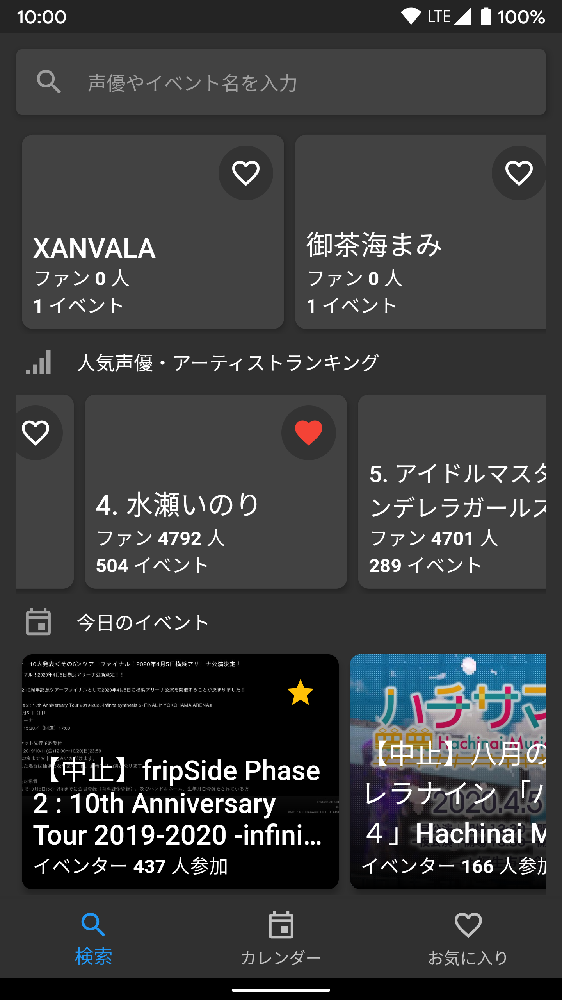 | 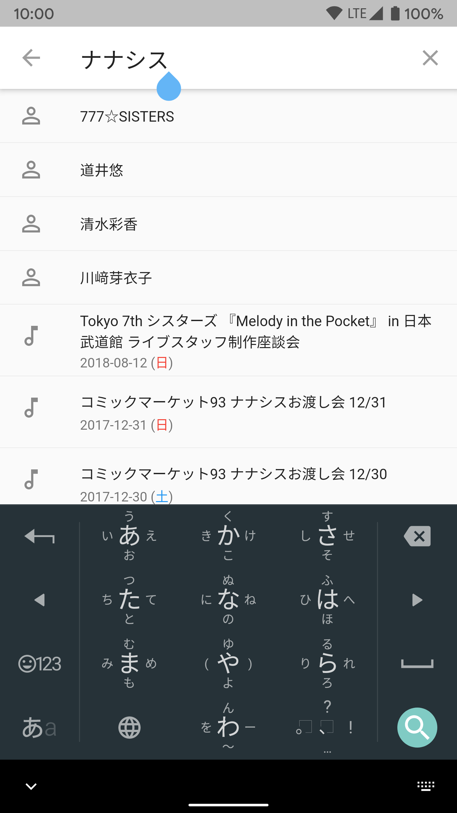 | 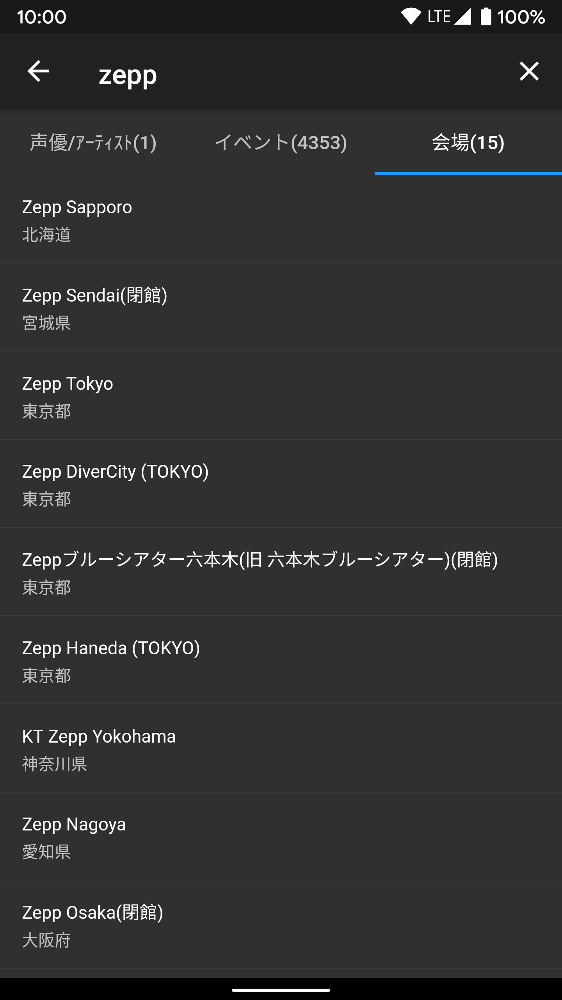 |

As the name suggests, Eventersearch's primary feature is to search through events on Eventernote.

### Calendar view

| Calendar (week) | Calendar (month) | Choose date |
| --- | --- | --- |
| 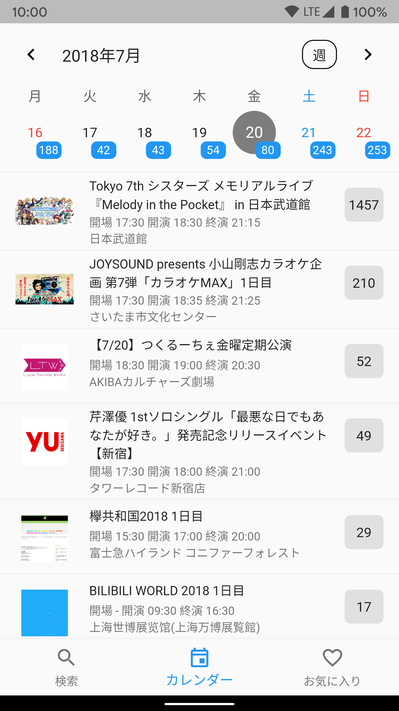 | 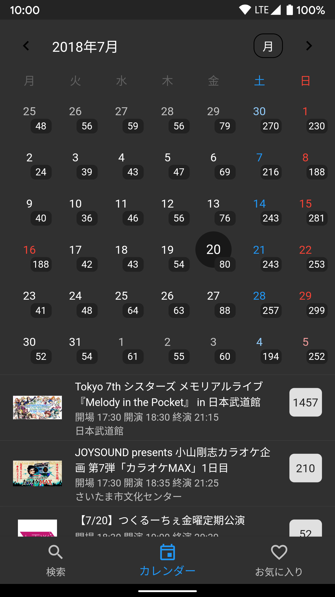 | 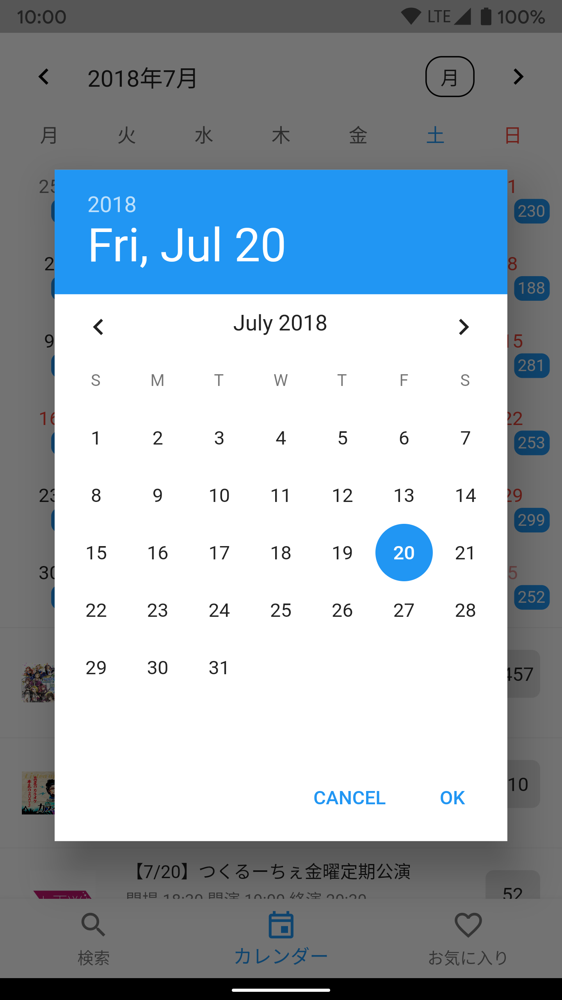 |

Eventersearch also supports a calendar view, [similar to Eventernote](https://www.eventernote.com/events/calendar).

### Favorites

| Favorite seiyuu/artists | Favorite artists' events | Favorite events |
| --- | --- | --- |
| 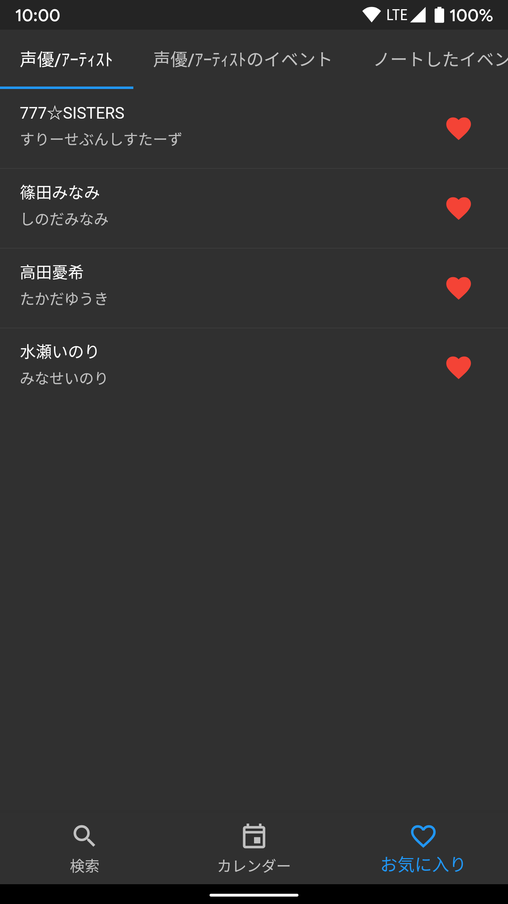 | 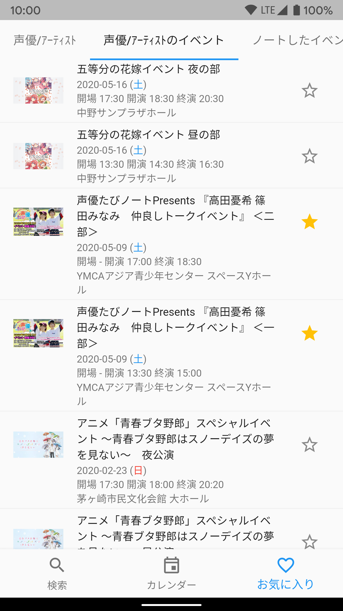 | 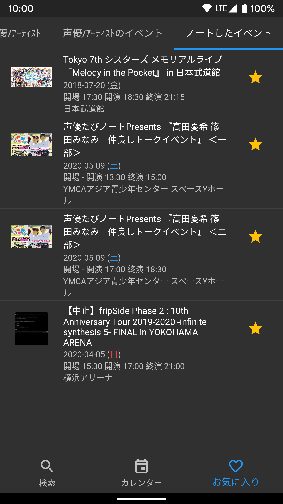 |

Due to lack of login API, there is no way to connect your Eventernote account to the app. Additionally, all favorites are cleared on app close (read: I got a bit lazy).

### Details pages

| Seiyuu/artist | Event | Venue |
| --- | --- | --- |
| 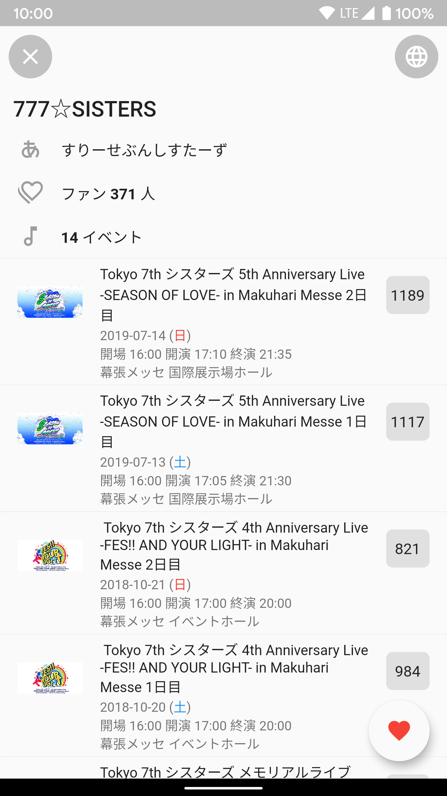 | 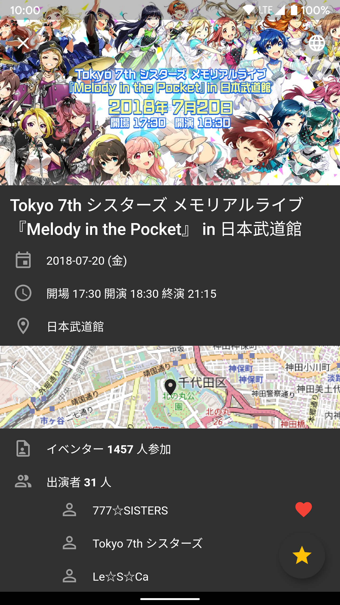 | 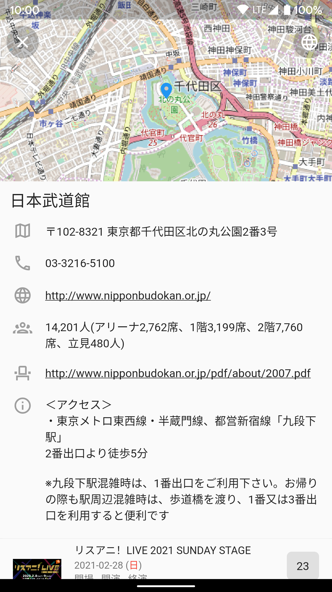 |

Eventersearch can also display most artist, event, and venue information available on Eventernote (not including user information).

## Installation

### Android

Download the APK file from the [latest release](https://github.com/usashiki/Eventersearch/releases/latest). Alternatively, clone the repo and build the APK yourself with `flutter build apk`.

### iOS

TODO (Unfortunately I currently do not have a suitable iOS device to test iOS on)

## Development

To get started with Flutter, follow Flutter's [official documentation](https://flutter.dev/docs/get-started/install).

## Meta

Written by fc ([@usashiki7](https://twitter.com/usashiki7)).
